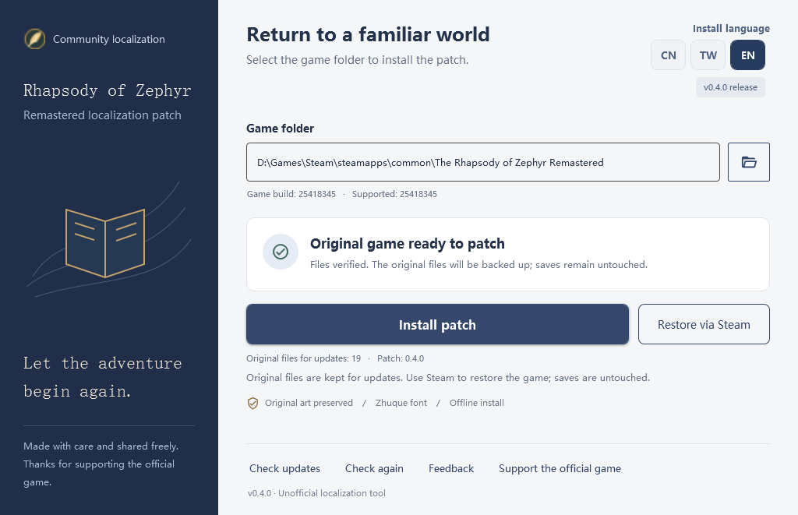

# 西风狂诗曲
### 重制版 · 简体中文 / 繁體中文 / English

**让记忆里的冒险再次启程。**

免费、非官方的三语言本地翻译补丁 · 保留原作美术字

[**下载汉化工具**](https://github.com/wanjizheng/zephyr-remastered-zh-cn/releases)　｜　[**边玩边校对 / Contribute**](docs/dialogue-review.md)　｜　[人物译名对照](#人物译名对照)　｜　[反馈问题](https://github.com/wanjizheng/zephyr-remastered-zh-cn/issues)　｜　[支持正版](https://store.steampowered.com/app/5099430/)

[简体中文](#简体中文使用说明) · [繁體中文](#繁體中文使用說明) · [English](#english-guide)

---

## v0.4.4 · 边玩边校对，让这段冒险因你更好

**不必会编程，也不必翻译整章。从你发现的那一句开始。**

一句不自然的对白、一个不合人物语气的称呼、一处错字，都值得被认真打磨。现在可以从安装器打开 **“对白校对”**，一边玩，一边查看捕获的台词、写下自己的修改建议，再导出交给维护者审阅。**简体、繁体和英文玩家都可以参与。**

**遇到一句 → 写下建议 → 导出修改包 → 在 GitHub 提交 → 审阅采用后进入后续更新。**

不用截图抄整段，也不用寻找资源文件：可识别的台词会带上定位与版本信息。最近 20 句方便回看，已修改条目单独保留。你也可以只说明哪里不对，让社区一起讨论更好的表达。我们希望这不只是一个下载补丁的地方，更是喜欢这部作品的人共同打磨译文的地方。

[**开始参与：中文操作教程**](docs/dialogue-review.md) · [**English contribution guide**](docs/dialogue-review.en.md) · [**提交翻译建议**](https://github.com/wanjizheng/zephyr-remastered-zh-cn/issues/new?template=translation.yml) · [**下载 v0.4.4**](https://github.com/wanjizheng/zephyr-remastered-zh-cn/releases/tag/v0.4.4)

> 校对记录只在本次窗口会话中保留，**关闭前请导出**。建议不会立即改动游戏或自动提交。部分对话可能尚不能定位；遇到漏句仍可附截图反馈。详见教程中的排查说明。

## Play, notice, improve — help shape the translation

**You do not need to code or translate a whole chapter. One thoughtful correction is enough to contribute.**

v0.4.4 brings **Dialogue review** to the public release: play the game, capture a supported line, suggest clearer or more natural wording, and export it for review. English, Simplified Chinese, and Traditional Chinese players are all welcome. Help a character sound like themselves, clarify a confusing sentence, or catch a typo that everyone else missed.

**Notice a line → suggest an improvement → export → submit an issue → accepted changes reach a future patch.** The assistant includes line and version information for captured entries, so you can focus on the words. You can also leave a note without writing a replacement. Let's make this a place where players help one another enjoy the story, one line at a time.

[**Read the English tutorial**](docs/dialogue-review.en.md) · [**Contribute a suggestion**](https://github.com/wanjizheng/zephyr-remastered-zh-cn/issues/new?template=translation.yml) · [**Download v0.4.4**](https://github.com/wanjizheng/zephyr-remastered-zh-cn/releases/tag/v0.4.4)

> **Export before closing:** review records last only for the current window session. Suggestions do not change the running game or submit themselves. Some dialogue cannot yet be located; screenshots and manual reports are welcome too.

## English guide

**The Rhapsody of Zephyr Remastered — unofficial, free localization for Simplified Chinese, Traditional Chinese, and English.** The patcher modifies only a player's legally installed Steam copy on their own computer. It does not provide the game, upload game files, or require a GitHub account.

1. Download **`Zephyr-Chinese-Patcher-0.4.4.zip`** from [GitHub Releases](https://github.com/wanjizheng/zephyr-remastered-zh-cn/releases/tag/v0.4.4). Download the ZIP asset, not GitHub's “Source code” archive.
2. Extract the whole ZIP and run `ZephyrChinesePatcher.exe` on Windows 10 or 11 (x64). Keep the `tools`, `payload`, and `licenses` folders beside the program. No separate .NET, Python, or Unity installation is needed.
3. Save and fully exit the game. Choose **EN** at the top right of the patcher, select the folder containing `ZephyrRemastered.exe`, then install. **CN** installs Simplified Chinese; **TW** installs Traditional Chinese. The same buttons change the patcher's interface language.
4. To change languages, select another button and install again. To return to the original game, use the patcher's **Steam verification** button. An interrupted or failed installation can be rolled back automatically; saved games are not changed.

This release supports Steam App **5099430**, game Build **25418345**. It cannot safely patch other game builds or files modified by another mod. **Traditional Chinese only converts Simplified characters; its wording has not been adapted to regional speech. The English version was translated directly by GPT from the established Simplified Chinese translation, including its settled character relationships and other information. Due to time constraints, it has not received extensive English font or interface refinement.** Only specific reported layout issues were adjusted. Video subtitles are outside the current patch scope. Please [report any problems promptly](https://github.com/wanjizheng/zephyr-remastered-zh-cn/issues) with the tool version, game build, scene, and a screenshot; do not upload full game resources, saves, account details, or full logs containing personal paths.

This is an independent fan project, unaffiliated with the developer or publisher. Please [buy the game on Steam](https://store.steampowered.com/app/5099430/). See the [bilingual changelog](CHANGELOG.md) and [license notices](THIRD_PARTY_NOTICES.md).

## 繁體中文使用說明

**《西風狂詩曲 重製版》免費、非官方的簡體中文、繁體中文及英文翻譯補丁。** 安裝工具只會在玩家自己的電腦上修改合法安裝的 Steam 遊戲檔案；不提供遊戲本體，也不會上傳遊戲資源。

1. 從 [GitHub Releases](https://github.com/wanjizheng/zephyr-remastered-zh-cn/releases/tag/v0.4.4) 下載 **`Zephyr-Chinese-Patcher-0.4.4.zip`**。請下載 ZIP 安裝包，不要下載 GitHub 自動產生的「Source code」。
2. 完整解壓縮，在 Windows 10／11 x64 執行 `ZephyrChinesePatcher.exe`。請保留旁邊的 `tools`、`payload` 和 `licenses` 資料夾；不必另外安裝 .NET、Python 或 Unity。
3. 儲存進度並完全關閉遊戲。在工具右上角選 **TW**，選擇包含 `ZephyrRemastered.exe` 的遊戲資料夾後安裝。**CN** 為簡體中文，**EN** 為英文；按鈕也會切換安裝工具本身的介面語言。
4. 要切換語言，選擇另一個按鈕並重新安裝。要回復原版，請按工具內的 **Steam 驗證**按鈕。安裝失敗時工具會自動回滾；不會修改存檔。

本版支援 Steam App **5099430**、遊戲 Build **25418345**。遊戲更新或其他 MOD 修改相關檔案後，工具會暫停安裝，避免覆蓋未知資料。**繁體版只將簡體字轉成繁體字，沒有針對繁體中文的口語習慣改寫。英文版因時間有限，由 GPT 直接根據已確定人物關係及其他資訊的簡體中文譯文進行 AI 翻譯；英文的字體和介面也沒有做全面優化，只修正了已回報的部分顯示問題。**影片內字幕暫未處理。如有任何問題，請及時到 [Issues](https://github.com/wanjizheng/zephyr-remastered-zh-cn/issues) 附上版本、場景和截圖；請勿上傳完整遊戲資源、存檔、帳號資料或含個人路徑的整份日誌。

本專案與開發商及發行商無關。請[支持 Steam 正版](https://store.steampowered.com/app/5099430/)；更新內容見[中英雙語更新日誌](CHANGELOG.md)，第三方授權見[授權聲明](THIRD_PARTY_NOTICES.md)。

## 简体中文使用说明

## 写在前面

小时候，我特别喜欢《西风狂诗曲》。1998 年的原作，以及后来陪伴我们的老中文版，留下了很多难忘的回忆。如今重制版来了，我想再走一遍那段旅程，也希望更多中文玩家能读懂这个故事，于是有了这个免费的汉化项目。

但对旧中文版的部分译名和对白，我一直有些遗憾：有些人名拗口，同一个人物在不同资料中有不同叫法，一些剧情表达也读得不够顺畅。**这次我以重制版韩文资源为基础重新翻译，优化对白和术语，并对部分人物姓名重新定译。** 熟悉的故事还在，希望读起来更清楚，也更贴近人物当时的处境。

> [!IMPORTANT]
> **本项目的简体、繁体和英文翻译均为非官方补丁。** 在工具右上角选 CN／TW／EN 后安装，游戏内无需另找语言选项。要恢复未打补丁的游戏文件，请使用工具中的 Steam 验证入口；工具不会修改存档。

## 汉化实机预览

以下为玩家提供的实际游戏截图，点击可查看原图。游戏画面版权归原权利方所有，仅用于展示汉化效果。

| 角色与技能 | 探索对白 |
| :---: | :---: |
|  |  |
| 战斗界面 | 剧情对话 |
|  |  |

## 运行环境

- **Windows 10 / 11，64 位（x64）。** 需要已安装的正版游戏及受支持的游戏版本。
- 官方发行 ZIP 已包含 **.NET 10 运行时和 Python 引擎依赖**，玩家无需另外下载 .NET、Python 或 Unity；开发者编译要求见 [开发说明](DEVELOPMENT.md)。
- 主程序采用 .NET 原生单文件发布，MaterialDesignThemes 5.3.2、MaterialDesignColors 和 XAML Behaviors 一起整合到 EXE；Python 引擎也以单文件发布。首次启动会在本机临时目录解压必要的运行库，无需另外安装 .NET 或 Python。
- 发行 ZIP 仅包含运行必需的主程序、`tools/` 引擎、`payload/` 汉化数据，以及 `LICENSE`、`THIRD_PARTY_NOTICES.md`、`licenses/` 许可声明。文档与截图仅在仓库提供。请完整解压发行 ZIP。`tools`、`payload` 和许可文件仍需保留，不能只复制主程序 EXE。旧版的 `es`、`fr`、`it`、`ja`、`ko` 等目录是运行库的语言资源，不是额外游戏翻译；新版不再将它们散放在程序目录。

## 开始游玩

| 下载 | 安装 | 恢复 |
| :--- | :--- | :--- |
| 在 [Releases](https://github.com/wanjizheng/zephyr-remastered-zh-cn/releases/tag/v0.4.4) 下载程序 ZIP | 退出游戏，选 CN／TW／EN 和游戏目录，再点击安装 | 退出游戏，用工具中的 Steam 验证入口恢复原版 |
| 完整解压，不要只取出 EXE | 等待校验完成，再自行启动游戏 | Steam 完成验证后由工具重新检测，不改动存档 |

1. 下载 `Zephyr-Chinese-Patcher-*.zip`，**不要把 Source code 当作安装包**。
2. 完整解压到可写文件夹，运行 `ZephyrChinesePatcher.exe`。无需另装 Python、.NET 或 Unity。
3. 工具会尝试识别 Steam 目录；也可手动选择包含 `ZephyrRemastered.exe` 的文件夹。
4. 保存并正常退出游戏，再安装汉化。处理期间请勿启动游戏、验证 Steam 文件或强行关闭工具。
5. 右上角 **CN／TW／EN** 同时控制工具界面语言和安装的游戏语言包；需要换语言时，选择另一项并重新安装。

<strong>查看程序界面（示例路径与状态）</strong>

## 这次重译，改了什么？

| 重点 | 本次处理 |
| :--- | :--- |
| **人名与术语** | 对照韩文姓名及资源内的拉丁拼写统一定译；正文、称呼和界面尽量一致，保留新旧译名对照方便查攻略。 |
| **剧情表达** | 结合说话人、上下文和事件分支梳理句意，减少直译腔；区分指控与事实、推测与确认，避免因译法改变剧情含义。 |
| **人物语气** | 注意身份、关系和情绪，让不同人物说话有所区别；不把所有对白写成现代口语，也不一律套用“在下／阁下”。 |
| **阅读观感** | 主要中文字体采用朱雀仿宋；保留标题 Logo、花体主菜单等原有美术效果，不用普通汉字强行覆盖。 |

目标是尽量做到**信、达、雅**。制作过程中使用了 AI 辅助、术语统一和分批复核，仍在通过实际游玩持续修订；这不是“全稿已经逐句独立人工验收”的承诺。发现不自然的台词、漏译或排版问题，欢迎带着上下文来反馈。

## 人物译名对照

读老攻略时，看到“希罗尼”“迦娜”“狮头船长”，可以用下表找到本项目中的对应称呼。**这里只对照姓名，不展开人物关系与结局，尽量避免剧透。**

“老中文版／旧资料译名”收录老攻略和玩家对照资料中的常见写法，**不表示它们全部出自同一地区、同一发行版本**，也未逐项完成原版截图核验。“待核”表示缺少可靠的旧名对应，并非该人物尚未汉化。来源及逐项记录见 [人物对照说明](docs/character-names.md)。

| 韩语原名 | 老中文版／旧资料译名 | 本项目新版译名 |
| :--- | :--- | :--- |
| 시라노 번스타인 | 希罗尼·班史顿 | **西拉诺·伯恩斯坦** |
| 메르세데스 보르자 | 梅尔西迪斯·伯尔嘉 | **梅尔塞德斯·博尔吉亚** |
| 체사레 보르자 | 蔡斯尔·伯尔嘉 | **切萨雷·博尔吉亚** |
| 로베르토 데 메디치 | 罗伯特·荻·梅迪西 | **罗伯托·德·梅迪西** |
| 클라우제비츠 | 克勒杰比 | **克劳塞维茨** |
| 카나 밀라노비치 | 迦娜·密罗尼比琪 | **卡娜·米拉诺维奇** |
| 이자벨 리피네 | 伊莎贝·利比尼 | **伊莎贝尔·利普内茨** |
| 리델 하트 | 力德哈特／吕得·哈德 | **里德尔·哈特** |
| 캡틴 실버 | 狮头船长 | **希尔弗船长** |
| 샤른호스트 | 莎伦·哈斯特／沙伦沪斯特 | **沙恩霍斯特** |
| 에스메랄다 | 爱斯美若达 | **埃斯梅拉达** |
| 크리스 | 克丽丝／克莉丝 | **克里斯** |
| 크리스티나 | 完整姓名旧译待核 | **克里斯蒂娜** |
| 이올린 팬드래건 | 伊吴莲·番迪来建 | **伊奥琳·潘德拉根** |
| 데이모스 | 狄慕斯 | **戴莫斯** |
| 루이 셰페르 | 待核 | **路易·舍费尔** |
| 보르스 앙드레아 | 待核 | **博尔斯·安德烈亚** |

<strong>展开其他已统一的人物姓名（15 项）</strong>

| 韩语原名 | 老中文版／旧资料译名 | 本项目新版译名 |
| :--- | :--- | :--- |
| 루벤 | 罗宾 | 鲁本 |
| 알프레드 프레데릭 | 阿富瑞得·富瑞得利 | 阿尔弗雷德·弗雷德里克 |
| 마키아벨리 | 玛其亚贝利／马基雅维里 | 马基雅维利 |
| 이스카리옷 | 伊思卡利忒／伊斯葛利欧 | 伊斯卡里奥特 |
| 에스테 도데 | 爱思德·朵丽 | 埃斯特·多德 |
| 카타리나 | 卡特琳娜／佧他丽娜 | 卡塔莉娜 |
| 이루스 | 伊鲁斯 | 伊鲁斯 |
| 조세핀 | 待核 | 约瑟芬 |
| 디아블로 | 待核 | 迪亚布罗 |
| 라몬 | 待核 | 拉蒙 |
| 게리슨 | 待核 | 盖里森 |
| 라시드 3세 | 待核 | 拉希德三世 |
| 루크 번스타인 | 待核 | 卢克·伯恩斯坦 |
| 빈센트 번스타인 | 待核 | 文森特·伯恩斯坦 |
| 밀레 | 待核 | 米勒 |

表内共 32 项，覆盖本次已整理的主要人物及补充姓名，不冒充全部路人 NPC 名录。原文使用短称时，译文也保留短称，例如“西拉诺”“梅迪西”，不会每次都补全名。伊莎贝尔的姓氏按资源拉丁名 `Lipnetz` 定为“利普内茨”。称号与姓名分别处理，例如原文明确带称号时才写“圣女埃斯梅拉达”。

## 当前版本与内容范围

### 当前正式版本：v0.4.4

- **对白校对面向所有玩家开放**：从安装器打开，边玩边记录建议，支持简体、繁体和英文校对；导出带定位信息的修改包，提交给维护者审阅。查看[中文教程](docs/dialogue-review.md)／[English tutorial](docs/dialogue-review.en.md)。
- 本次工作平台构建采用 **31 条简体对白修订**，并同步对应繁体条目，继续改善剧情表达、称呼和人物语气；不代表英文版同步重译了这 31 条。
- 包含自 v0.4.1 以来积累的对白与中文字形修正，包括希尔弗相关台词和“吾”“渝”的字形调整。
- 保留 CN／TW／EN 安装与界面切换、签名更新元数据、安装失败自动回滚及 Steam 验证恢复入口。
- 完整升级请解压新包，避免混用旧工具和语言数据。见[中英双语更新日志](CHANGELOG.md)。

下载 [v0.4.4 正式版](https://github.com/wanjizheng/zephyr-remastered-zh-cn/releases/tag/v0.4.4)。

| 项目 | 说明 |
| :--- | :--- |
| 工具版本 | **v0.4.4** · 当前正式版 |
| 游戏语言 | 简体中文、繁體中文、English；不改变游戏本身的官方语言支持 |
| 支持游戏 | Steam App `5099430`，已核验 Build `25418345` 的精确资源版本 |
| 系统 | Windows 10 / 11 x64；自动化开发验证环境为 Windows 11 |
| 翻译范围 | 已整理的主线与可选剧情、普通界面等；繁体仅转换字形，英文由 GPT 直接基于简体版翻译 |
| 字体与美术 | 中文主要使用朱雀仿宋；英文界面和对话采用许可字体；保留原作 Logo 等美术字 |
| 暂未处理 | **视频内字幕**；不能保证所有分支已完成逐句人工验收 |

> [!NOTE]
> 游戏更新或其他 MOD 改动相关文件后，工具会暂停安装，避免覆盖未知文件。请先在 Steam 中验证游戏文件，等待与新 Build 匹配的补丁版本。工具保留原版备份用于更新和切换语言，但不再提供手动从旧备份恢复原版的入口。

工具从所选安装目录对应的 Steam appmanifest 读取当前 Build ID；读取不到时显示“未识别”。通过工具请求 Steam 验证后，它会定期检查资源状态，确认文件恢复原版后刷新安装按钮。Steam 的验证与下载由用户本机的 Steam 执行，不使用 Cookie、登录令牌或账号认证信息。

## 更新与常见问题

<strong>如何检查和安装更新？</strong>

启动工具后自动检查 GitHub Releases，也可点击“检查更新”。有新版本时提示并打开经过签名元数据验证的发布页面。下载、完整解压新版程序，再运行即可。不会静默安装，也不会在游戏运行时替换资源；网络不可用不影响本地安装与恢复。

<strong>备份在哪里？会影响存档吗？</strong>

更新与语言切换所需的原版备份和安装事务记录位于 `%LOCALAPPDATA%\ZephyrChinesePatcher\`，按游戏目录区分。安装前后都会核对文件哈希；存档不在修改清单中。恢复原版请使用 Steam 验证。

若操作中断，重新打开工具并点击“修复中断的安装”。如果资源又被其他工具修改，工具会停止而不会覆盖未知文件。

<strong>已有手动汉化，或 Steam 验证文件后该怎么办？</strong>

工具无法为手动安装的汉化凭空补出原版备份。请先用当时的原备份恢复，或通过 Steam 验证游戏文件，再使用本工具。Steam 更新或验证完整性可能移除汉化，之后需要安装相应兼容版本。

<strong>磁盘空间、权限和 Windows 下载提示</strong>

首次安装需要临时重建资源，建议系统盘与游戏所在磁盘均预留至少 5 GB。默认使用普通权限，游戏目录无写权限时才需要调整权限或使用管理员身份。

程序尚未进行 Windows Authenticode 签名，可能出现信誉提示。请只从本仓库 Releases 下载并核对 SHA-256，不要关闭杀毒软件。更新元数据签名与 Windows 程序签名是不同的机制。

## 一起把它打磨好

在 [Issues](https://github.com/wanjizheng/zephyr-remastered-zh-cn/issues) 告诉我：**工具版本、游戏版本、发生地点、复现步骤与必要截图**。对白问题请附前后语境；显示问题请说明分辨率和缩放。也欢迎提供旧版人名截图，补齐“待核”。请勿上传完整游戏资源、存档、账号信息或含个人路径的整份日志。

感谢原作与重制团队留下这个世界，也感谢字体作者与所有提供反馈的玩家。**如果你也喜欢它，请购买并支持 [Steam 正版](https://store.steampowered.com/app/5099430/)。**

---

<strong>非官方声明、公开内容与许可证</strong>

本项目免费、非官方，与游戏开发商、发行商没有隶属或授权关系，不提供游戏本体、破解或绕过购买验证的功能。

仓库和发行包只包含工具、三语言翻译改动数据、许可字形及开源运行依赖，不包含原版或翻译后的完整游戏资源、音乐、视频或存档。不变的资源和原始字形从玩家自己的游戏文件读取，重建结果留在本机。工具不自动上传游戏文件或个人信息；本地安装和校对无需 GitHub 登录，主动在 GitHub 提交建议需要账号。

自有工具代码采用 [MIT](LICENSE)；字体和依赖见 [第三方声明](THIRD_PARTY_NOTICES.md)。该许可证不授予原作、商标或剧情的权利。免费和补丁形式不等于官方授权；权利人可通过仓库联系维护者。目前只链接官方商店，不转载未经许可的官方宣传图。

<a href="DEVELOPMENT.md">开发与发行</a> · <a href="DATA_PROVENANCE.md">数据来源</a> · <a href="VALIDATION.md">验证记录</a> · <a href="docs/character-names.md">译名来源说明</a>

