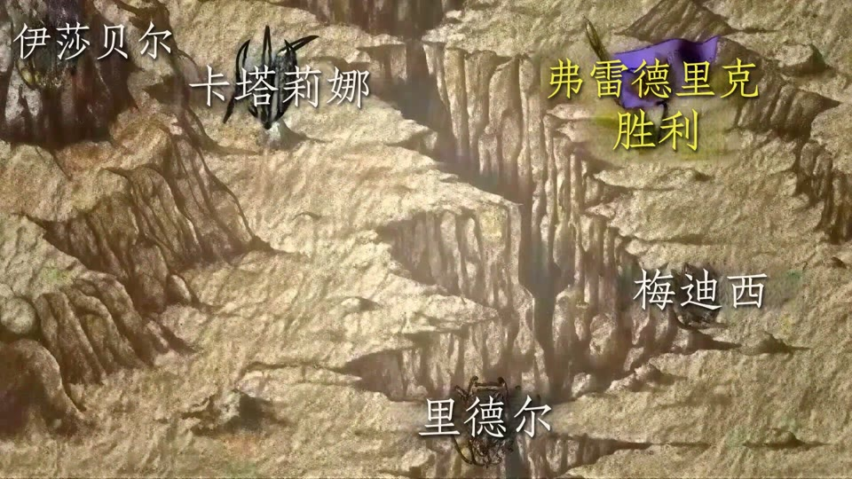
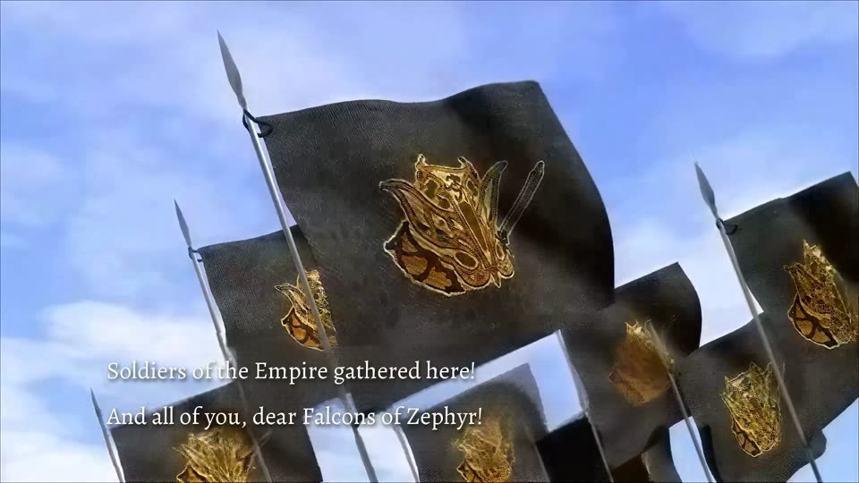
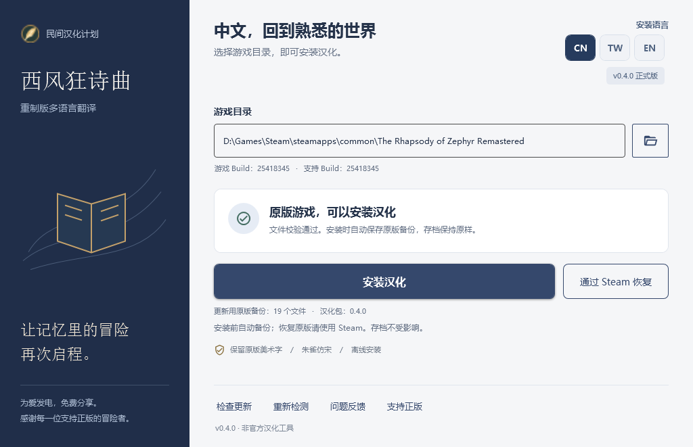

# 西风狂诗曲 · 重制版

**The Rhapsody of Zephyr Remastered**

让记忆里的冒险再次启程。

  

免费、非官方的三语翻译补丁 · 剧情动画文字本地化 · 边玩边校对

[**下载最新版本**](https://github.com/wanjizheng/zephyr-remastered-zh-cn/releases/latest)　 / 　[**查看动画效果**](#关键动画也能读懂了)　 / 　[**参与对白校对**](#边玩边校对)　 / 　[支持正版](https://store.steampowered.com/app/5099430/)

简体中文 · [繁體中文](README.zh-Hant.md) · [English](README.en.md)

---

## 写在前面的话

小时候，我特别喜欢《西风狂诗曲》。1998 年的原作，以及后来陪伴我们的老中文版，留下了很多难忘的回忆。如今重制版来了，我想再走一遍那段旅程，也希望更多中文玩家能读懂这个故事，于是有了这个免费的汉化项目。

但对旧中文版的部分译名和对白，我一直有些遗憾：有些人名拗口，同一个人物在不同资料中有不同叫法，一些剧情表达也读得不够顺畅。**这次我以重制版韩文资源为基础重新翻译，优化对白和术语，并对部分人物姓名重新定译。** 熟悉的故事还在，希望读起来更清楚，也更贴近人物当时的处境。

如今，除了剧情对白，也把那几段关键动画里嵌入画面的文字补上了。希望大家重回这个世界时，能把注意力放在故事上，少一些因为看不懂而错过的遗憾。

## 关键动画也能读懂了

**v0.5.3 的重点：三个主要关键剧情动画，嵌入画面的文字已全部完成对应语言处理。** 简体中文、繁體中文和 English 均已覆盖，随安装器选择的语言一同安装。

从地图上的人名与战况，到战术说明字幕，再到随旗帜展开的滚动演说，这三段动画里的信息终于可以和对白一起读懂。剧情走到关键处，不必再对着陌生的文字猜它在说什么。

<table>
<tr>
<th width="33%">地图与战况 简体中文</th>
<th width="33%">战术说明 繁體中文</th>
<th width="33%">滚动演说 English</th>
</tr>
<tr>
<td></td>
<td></td>
<td></td>
</tr>
</table>

以上为本次发行所用动画片源的截帧，含少量剧情画面；点击可查看大图。三段动画均覆盖三种语言。英文版中原本就是英文的地图片段保留原文。

本次正式发布也汇总了上一公开版本之后的修订：

- **二周目提示补全**：修复通关后再次开始新游戏时的继承提示、“是／否”按钮及相关说明，覆盖三语。
- **译文继续打磨**：合入对白、物品与技能描述修订，改善人物称呼和上下文衔接；修正相关剧情中的人物名字栏。
- **动画播放兼容性调整**：修复滚动演说动画的编码问题，简体已获游戏内播放确认。
- **对白校对持续保留**：三语玩家都可以边玩边记录问题，为后续更新贡献建议。

[阅读 v0.5.3 更新说明](changelogs/v0.5.3.md) · [完整更新历史](CHANGELOG.md)

## 开始游玩

**需要 Windows 10／11 x64，以及已安装的 Steam 正版游戏。** 当前对应 Steam App `5099430`、游戏 Build `25418345`；工具会核对资源版本。

1. 从 [最新发行页](https://github.com/wanjizheng/zephyr-remastered-zh-cn/releases/latest) 下载 **`Zephyr-Chinese-Patcher-*.zip`**。选择安装包，别把 GitHub 的 `Source code` 当作安装包。
2. **完整解压**，运行 `ZephyrChinesePatcher.exe`。保留同目录的 `tools`、`payload` 和许可文件；无需另外安装 .NET、Python 或 Unity。
3. 保存进度并完全退出游戏，选择包含 `ZephyrRemastered.exe` 的游戏目录，再选择右上角的语言。
4. 点击安装，等待完成后启动游戏。切换语言时，退出游戏、选择另一种语言，再安装一次即可。

| CN | TW | EN |
| :---: | :---: | :---: |
| 简体中文 | 繁體中文 | English |

语言按钮同时切换工具界面与安装的游戏语言，**无需再到游戏内寻找语言选项**。升级请完整解压新包，避免混用旧程序和新语言数据。恢复原版可使用工具中的 **Steam 验证**入口；工具不修改存档。

<strong>查看安装工具界面</strong>

界面中的路径与状态为示例。其他语言界面：[繁體中文](docs/interface-preview-tw.png) · [English](docs/interface-preview-en.png)。

## 边玩边校对

**不必会编程，也不必翻译整章。从你发现的那一句开始。**

从安装器打开 **“对白校对”**，一边玩，一边查看捕获的台词，为不自然的对白、错字或人物称呼写下建议。简体、繁体和英文玩家都可以参与。

**遇到一句 → 写下建议 → 导出修改包 → 提交给维护者 → 审阅采用后进入后续更新。**

可识别的台词会自动带上定位与版本信息，最近 20 句方便回看，已修改条目单独保留。你也可以只说明哪里不对，让大家一起讨论更好的表达。

[**查看中文教程**](docs/dialogue-review.md) · [**English tutorial**](docs/dialogue-review.en.md) · [**提交翻译建议**](https://github.com/wanjizheng/zephyr-remastered-zh-cn/issues/new?template=translation.yml)

> **关闭前请导出。** 校对记录只保留在当前窗口会话中；建议不会立即修改游戏或自动上传。部分台词可能无法定位，遇到漏句也可以附截图和前后语境反馈。

## 游戏中的样子

以下是玩家提供的实机截图。点击查看原图。

| 角色与技能 | 探索对白 |
| :---: | :---: |
|  |  |
| 战斗界面 | 剧情对话 |
|  |  |

游戏画面版权归原权利方所有，图片仅用于展示翻译效果。

## 这次重译，我们在意什么

| 重点 | 做法 |
| :--- | :--- |
| **人名与术语一致** | 对照韩文及资源中的拉丁拼写统一定译，兼顾正文、称呼和界面；保留新旧译名对照，方便查老攻略。 |
| **剧情表达清楚** | 结合说话人、上下文和事件分支梳理句意，注意区分指控与事实、推测与确认。 |
| **人物有自己的语气** | 根据身份、关系和情绪调整表达，减少直译腔，也避免把所有对白套进同一种口吻。 |
| **保留原作的观感** | 中文主要采用朱雀仿宋，保留标题 Logo、花体主菜单等美术字；动画文字随语言切换。 |

制作过程中使用了 AI 辅助、术语统一和分批复核，仍在通过实际游玩持续修订。繁体以简体字形转换为基础，尚未全面按地域用语润色；英文以已整理的简体译文为基础进行 AI 翻译，并持续校对。**三语均不代表全部分支已经逐句完成人工验收。**

三段关键动画的文字覆盖已完成；其他未列出的片段、原作美术字和所有游玩分支，不包含在“这三段已完成”的承诺内。三语资源均通过离线重建校验，繁体、英文的游戏内播放与排版仍欢迎玩家反馈。

## 人物译名对照

读老攻略时，可以用下表找到熟悉人物的新称呼。这里只列姓名，不展开人物关系与结局。

| 老中文版／旧资料中的常见译名 | 本项目译名 |
| :--- | :--- |
| 希罗尼·班史顿 | **西拉诺·伯恩斯坦** |
| 梅尔西迪斯·伯尔嘉 | **梅尔塞德斯·博尔吉亚** |
| 蔡斯尔·伯尔嘉 | **切萨雷·博尔吉亚** |
| 罗伯特·荻·梅迪西 | **罗伯托·德·梅迪西** |
| 迦娜·密罗尼比琪 | **卡娜·米拉诺维奇** |
| 狮头船长 | **希尔弗船长** |

[查看完整 32 项对照与来源说明](docs/character-names.md#完整人物译名对照)。旧资料中的写法并非全部来自同一发行版本；标为“待核”的是旧名对应关系，不表示角色漏译。

## 常见问题

<strong>游戏更新了，或装过其他 MOD，还能直接安装吗？</strong>

工具只处理经核验的资源版本。遇到未知文件会暂停安装；请通过 Steam 验证游戏文件，或等待适配新 Build 的补丁。Steam 更新或验证完整性可能移除翻译，之后需要重新安装兼容版本。

<strong>会影响存档吗？安装失败怎么办？</strong>

存档不在修改清单中。安装失败时工具尝试自动回滚；操作中断后可重新打开工具，使用“修复中断的安装”。备份与事务记录保存在 `%LOCALAPPDATA%\ZephyrChinesePatcher\`，按游戏目录区分。恢复原版请使用 Steam 验证。

<strong>如何更新？需要登录 GitHub 吗？</strong>

工具启动时会检查更新，也可以手动点击“检查更新”。有新版本时打开经签名元数据验证的发行页，由你下载并完整解压。不会静默更新；网络不可用不影响本地安装。本地使用和校对无需 GitHub 登录，在 GitHub 提交反馈时才需要账号。

<strong>为什么安装包变大了？需要多少空间？</strong>

当前安装包包含三语字体与关键动画的本地化数据，体积较早期版本增加。首次安装需要备份并临时重建资源，建议系统盘和游戏所在磁盘各预留至少 5 GB。

<strong>Windows 提示应用信誉不足，怎么办？</strong>

程序尚未进行 Windows Authenticode 签名，可能出现信誉提示。请从本仓库 Releases 下载，核对发行页的 SHA-256；不要关闭杀毒软件。发行元数据的签名校验与 Windows 程序签名是两回事。

## 一起把它打磨好

发现问题，欢迎到 [Issues](https://github.com/wanjizheng/zephyr-remastered-zh-cn/issues) 留下 **工具版本、游戏版本、发生地点、复现步骤与必要截图**。对白问题请附前后语境；显示问题请说明分辨率和缩放。请勿上传完整游戏资源、存档、账号信息或含个人路径的整份日志。

感谢原作与重制团队留下这个世界，也感谢字体作者和每一位提供反馈的玩家。如果你也喜欢它，请购买并支持 [Steam 正版](https://store.steampowered.com/app/5099430/)。

**其他语言 / Other languages：** [繁體中文使用說明](README.zh-Hant.md) · [English guide](README.en.md)

---

<strong>非官方声明、资源与许可证</strong>

本项目免费、非官方，与游戏开发商、发行商没有隶属或授权关系。不提供游戏本体、破解或绕过购买验证的功能，仅用于在玩家合法安装的 Steam 游戏上应用翻译。

工具不自动上传游戏文件或个人信息。与早期版本不同，当前发行包包含加密封装的本地化视频资源，安装时在本机还原；加密不改变这些内容属于原作资源的事实。其余未修改资源从玩家自己的游戏文件读取。详见 [视频语言包说明](docs/video-localization.md)。

自有工具代码采用 [MIT](LICENSE)；字体与依赖见 [第三方声明](THIRD_PARTY_NOTICES.md)。该许可证不授予原作、商标或剧情的权利。权利人可通过仓库联系维护者。

<a href="DEVELOPMENT.md">开发与发行</a> · <a href="DATA_PROVENANCE.md">数据来源</a> · <a href="VALIDATION.md">验证记录</a> · <a href="CHANGELOG.md">更新历史</a>

