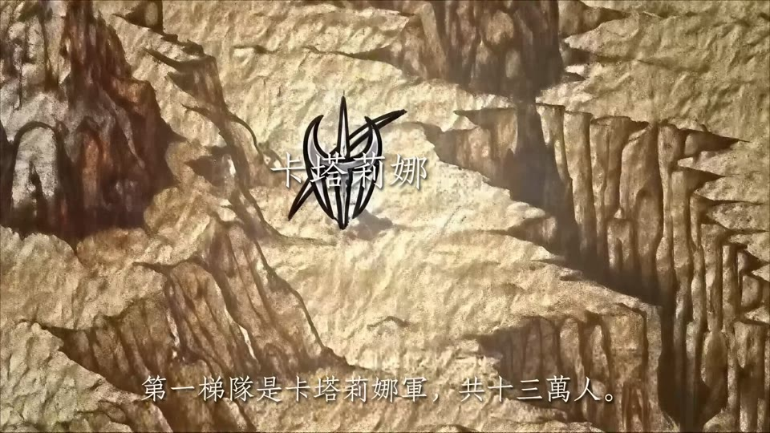
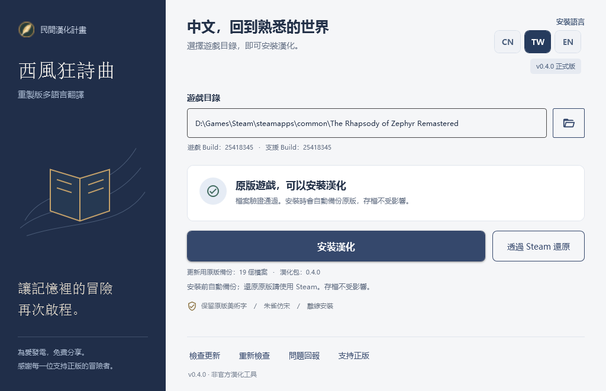

# 西風狂詩曲 · 重製版

**The Rhapsody of Zephyr Remastered**

讓記憶裡的冒險再次啟程。

免費、非官方的三語翻譯補丁 · 劇情動畫文字本地化 · 邊玩邊校對

[**下載最新版本**](https://github.com/wanjizheng/zephyr-remastered-zh-cn/releases/latest) · [**參與對白校對**](docs/dialogue-review.md) · [支持正版](https://store.steampowered.com/app/5099430/)

[简体中文](README.md) · 繁體中文 · [English](README.en.md)

## 寫在前面的話

小時候，我特別喜歡《西風狂詩曲》。1998 年的原作，以及後來陪伴我們的老中文版，留下了許多難忘的回憶。如今重製版來了，我想再走一遍那段旅程，也希望更多中文玩家能讀懂這個故事，於是有了這個免費的漢化專案。

對舊中文版的部分譯名和對白，我一直有些遺憾。這次以重製版韓文資源為基礎重新翻譯，整理對白、術語及部分人物姓名。希望熟悉的故事讀起來更清楚，也更貼近人物當時的處境。

如今，幾段關鍵動畫裡嵌入畫面的文字也補上了。希望大家重回這個世界時，能把注意力放在故事上，少一些因為看不懂而錯過的遺憾。

## 關鍵動畫也能讀懂了

**v0.5.3 已完成三個主要關鍵劇情動畫的嵌入文字處理**，包括地圖上的人名與戰況、戰術說明字幕，以及滾動演說。簡體中文、繁體中文和 English 均已涵蓋，隨所選語言一起安裝；英文版中原本就是英文的地圖片段保留原文。

本次發行所用片源的截圖，含少量劇情畫面。[查看其他動畫範例](README.md#关键动画也能读懂了)。

本次也包含通關後開始新遊戲的繼承提示與「是／否」按鈕翻譯、累積的對白與人物名稱修訂，以及演說動畫的播放相容性調整。**「對白校對」仍持續提供給三語玩家使用。**

[v0.5.3 更新說明](changelogs/v0.5.3.md) · [更新歷史](CHANGELOG.md)

## 開始遊玩

需要 **Windows 10／11 x64**，以及已安裝的 Steam 正版遊戲。對應 Steam App **5099430**、Build **25418345**；工具會核對資源版本。

1. 從 [最新發行頁](https://github.com/wanjizheng/zephyr-remastered-zh-cn/releases/latest) 下載 **`Zephyr-Chinese-Patcher-*.zip`**，請勿把 GitHub 自動產生的 `Source code` 當作安裝包。
2. 完整解壓縮，執行 `ZephyrChinesePatcher.exe`。保留旁邊的 `tools`、`payload` 和授權檔案；不必另外安裝 .NET、Python 或 Unity。
3. 儲存進度並完全關閉遊戲。選擇右上角的 **TW**，指定包含 `ZephyrRemastered.exe` 的資料夾後安裝。
4. 完成後啟動遊戲。切換語言時，退出遊戲、選擇 **CN／TW／EN**，再安裝一次。恢復原版請使用工具中的 **Steam 驗證**入口。

語言按鈕同時切換工具介面與遊戲翻譯，不必再到遊戲內尋找語言選項。工具不修改存檔。升級時請完整解壓縮新包，避免混用舊程式與新語言資料。

<strong>查看安裝工具介面</strong>

## 邊玩邊校對

**不必會寫程式，也不必翻譯整章。從你發現的那一句開始。**

從安裝器開啟「對白校對」，查看捕獲的台詞，為不自然的對白、錯字或稱呼留下建議。最近 20 句方便回看，已修改條目另行保留。也可以只說明問題，不必一定寫出替代譯文。

**遇到一句 → 寫下建議 → 匯出修改包 → 提交給維護者 → 審閱採用後進入後續更新。**

[**查看操作教學**](docs/dialogue-review.md) · [**提交翻譯建議**](https://github.com/wanjizheng/zephyr-remastered-zh-cn/issues/new?template=translation.yml)

> **關閉前請先匯出。** 校對記錄只保留在目前視窗的工作階段；建議不會立即修改遊戲或自動上傳。部分台詞可能無法定位，也歡迎附截圖及前後語境回報。

## 翻譯範圍與回報

繁體版以簡體字形轉換為基礎，尚未全面依地區用語潤飾；英文版以已整理的簡體稿為基礎進行 AI 翻譯，持續校對中。三語均不代表所有分支已逐句完成人工驗收。

動畫文字完成的範圍是上述三段，未列出的片段與原作美術字不在此承諾內。三語資源均通過離線重建校驗；演說動畫的簡體播放相容性已獲遊戲內確認，繁體及英文的遊戲內播放與排版仍歡迎回報。

請到 [Issues](https://github.com/wanjizheng/zephyr-remastered-zh-cn/issues) 提供工具版本、遊戲版本、場景、重現步驟與截圖。對白問題請附前後文；請勿上傳完整遊戲資源、存檔、帳號資訊或含個人路徑的整份記錄。

<strong>更新、空間與安裝問題</strong>

- 遊戲更新或其他 MOD 修改相關檔案後，工具會停止安裝。Steam 驗證可能移除翻譯，之後需要重新安裝相容版本。
- 首次安裝需要備份與暫時重建資源，建議系統磁碟及遊戲磁碟各保留至少 5 GB。新包包含動畫本地化資料，因此比早期版本更大。
- 安裝失敗時工具會嘗試自動回復；中斷後可重新開啟工具並修復安裝。備份位於 `%LOCALAPPDATA%\ZephyrChinesePatcher\`。
- 本機使用與校對不需要 GitHub 帳號；在 GitHub 提交回報才需要登入。
- 程式尚未進行 Windows Authenticode 簽署，可能出現信譽提示。請從本倉庫 Releases 下載並核對 SHA-256，不要關閉防毒軟體；更新中繼資料的簽署是另一套機制。

## 聲明與授權

本專案免費、非官方，與開發商及發行商沒有隸屬或授權關係。不提供遊戲本體、破解或繞過購買驗證的功能。請支持 [Steam 正版](https://store.steampowered.com/app/5099430/)。

工具不會自動上傳遊戲檔案或個人資訊。目前發行包包含加密封裝的本地化影片資源，安裝時在本機還原；加密不改變原作內容的權利歸屬。詳細資訊見 [影片語言包說明](docs/video-localization.md)。

自有工具程式採用 [MIT](LICENSE)；字型及相依套件見 [第三方授權聲明](THIRD_PARTY_NOTICES.md)。這些授權不包含遊戲、美術、劇情或商標的權利。
